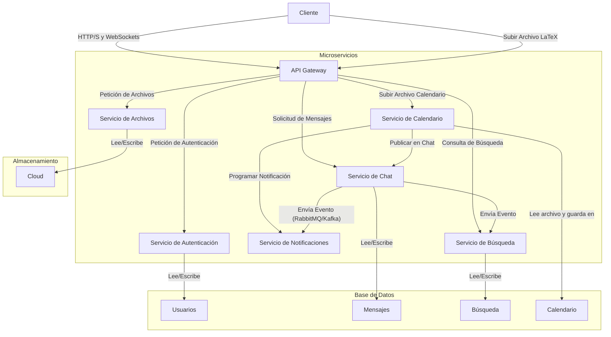
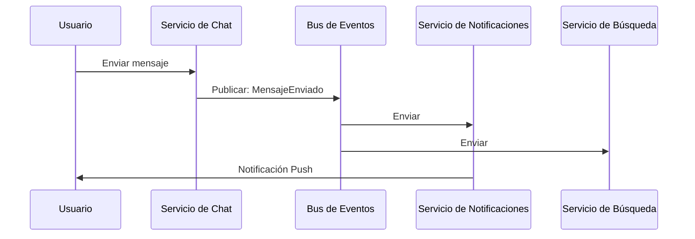

# secreto-en-el-lago
LPWWW202502 Secreto en el lago





```mermaid
graph TD
    %% Inicio del proceso
    A[Inicio: Usuario sube archivo LaTeX] --> B{API Gateway enruta a Servicio de Calendario};

    %% Flujo principal del servicio de calendario
    B --> C[Servicio de Calendario recibe archivo];
    C --> D[Leer el archivo de texto];
    D --> E{Buscar el patrón de fecha `\evento{...}{...}`};

    %% Ramificaciones del proceso
    E -- No se encuentra el patrón --> F[Generar un error];
    F --> G[Notificar al usuario sobre error en el formato];
    E -- Patrón encontrado --> H[Extraer evento y fecha];
    H --> I{Validar el formato de la fecha};

    %% Flujo de validación
    I -- Fecha inválida --> J[Generar un error];
    J --> G;
    I -- Fecha válida --> K[Guardar evento y fecha en la Base de Datos de Calendario];

    %% Flujo de publicación y notificación
    K --> L[Programar notificaciones para el evento];
    L --> M[Enviar evento al Servicio de Notificaciones];
    
    K --> N[Publicar en el chat];
    N --> O[Enviar evento al Servicio de Chat para publicación];

    %% Final del proceso
    O --> P[Fin];
    M --> P;
    G --> P;
```
