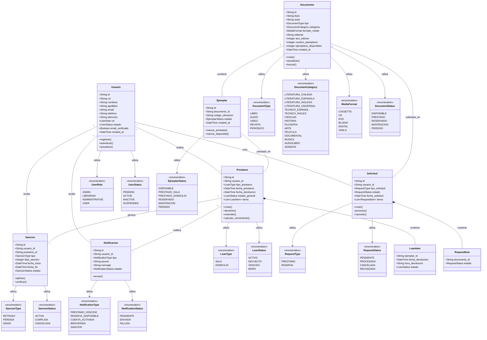

# Sistema de Biblioteca Municipal - Backend

Backend desarrollado con FastAPI para el sistema de préstamos de la Biblioteca Municipal de Estación Central.

## Características

- **Gestión de Usuarios**: Registro, autenticación y roles (Admin, Bibliotecario, Administrativo, Usuario)
- **Catálogo Digital**: Búsqueda y consulta de documentos y multimedia
- **Sistema de Préstamos**: Préstamos en sala y a domicilio con control de vencimientos
- **Reservas**: Sistema de reservas de documentos
- **Notificaciones**: Emails automáticos para verificación, recordatorios y sanciones
- **Monitoreo**: Dashboard Grafana con métricas en tiempo real
- **Logs Estructurados**: Sistema de logging con Loki y Prometheus
- **Mensajería**: Kafka para procesamiento asíncrono de eventos ([Documentación email](docs/email.md))

## Arquitectura

```bash
biblioteca-backend/
├── app/
│ ├── config/ # Configuración y base de datos
│ ├── models/ # Modelos de Pydantic
│ ├── schemas/ # Esquemas y tipos de datos
│ ├── services/ # Lógica de negocio
│ ├── routes/ # Endpoints de la API
│ ├── middleware/ # Middleware de autenticación y logging
│ ├── monitoring/ # Métricas y monitoreo
│ └── utils/ # Utilidades y helpers
├── scripts/ # Scripts de BD e inicialización
├── kafka/ # Configuración de Kafka
├── grafana/ # Dashboards y configuración
└── monitoring/ # Configuración de Prometheus y Loki
```

## Prerrequisitos

- Docker y Docker Compose
- Python 3.11+
- MongoDB Atlas (o local)
- Cuenta de email para notificaciones

## Instalación

1. Clonar el repositorio

```bash
git clone <repository-url>
cd biblioteca-backend
```

2. Configurar variables de entorno

Agregar `.env`

3. Construir y ejecutar con Docker

```bash
docker-compose up --build
```

## Usos

### Servicios disponibles

- API Backend: http://localhost:8000
- Documentación API: http://localhost:8000/docs
- Grafana: http://localhost:3000 (admin/admin123)
- Kafka UI: http://localhost:8080

### Usuarios de prueba

- Administrador: admin@biblioteca.cl / secret
- Bibliotecario: bibliotecario@biblioteca.cl / secret
- Administrativo: administrativo@biblioteca.cl / secret
- Usuario: usuario@biblioteca.cl / secret


## Ejemplos API

```bash
# Autenticación
curl -X POST "http://localhost:8000/api/v1/auth/login" \
  -H "Content-Type: application/x-www-form-urlencoded" \
  -d "username=admin@biblioteca.cl&password=secret"

# Consultar catálogo
curl -X GET "http://localhost:8000/api/v1/documents/"

# Crear préstamo
curl -X POST "http://localhost:8000/api/v1/loans/" \
  -H "Authorization: Bearer <token>" \
  -H "Content-Type: application/json" \
  -d '{
    "usuario_id": "user-id",
    "tipo_prestamo": "domicilio",
    "ejemplares_ids": ["ejemplar-id-1", "ejemplar-id-2"]
  }'
```

## Diagrama de clases



## Troubleshooting

### Problemas comunes

1. Error de conexión a MongoDB

- Verificar `MONGODB_URL` en .env
- Verificar red y firewall

2. Error de mail

- Verificar credenciales SMTP
- Usar "App Password" en Gmail

3. Kaftka no inicia

- Verificar que Docker tenga suficientes recursos
- Revisar logs: `docker-compose logs kafka`

## Logs

```bash
# Ver logs de la aplicación
docker-compose logs app

# Ver logs de Kafka
docker-compose logs kafka

# Ver logs de Grafana
docker-compose logs grafana
```
