# Diagrama de Clases - API Contracts del Sistema BEC Biblioteca

```mermaid
classDiagram
    %% ==================== ENUMS ====================
    class UserRole {
        <<enumeration>>
        LECTOR
        BIBLIOTECARIO
        ADMINISTRATIVO
    }

    class LoanType {
        <<enumeration>>
        SALA
        DOMICILIO
    }

    class LoanStatus {
        <<enumeration>>
        ACTIVO
        DEVUELTO
        VENCIDO
    }

    class DocumentType {
        <<enumeration>>
        LIBRO
        AUDIO
        VIDEO
    }

    class ItemStatus {
        <<enumeration>>
        DISPONIBLE
        PRESTADO
        EN_RESTAURACION
        RESERVADO
    }

    class ReservationStatus {
        <<enumeration>>
        ACTIVA
        COMPLETADA
        EXPIRADA
    }

    %% ==================== USER CONTRACTS ====================
    class UserBase {
        +string rut
        +string nombres
        +string apellidos
        +string direccion
        +string telefono
        +string email
        +UserRole rol
    }

    class UserCreate {
        +string password
        +string? foto_url
        +string? huella_ref
    }

    class UserUpdate {
        +string? nombres
        +string? apellidos
        +string? direccion
        +string? telefono
        +string? email
        +string? password
        +string? foto_url
        +string? huella_ref
        +bool? activo
        +datetime? sancion_hasta
    }

    class UserResponse {
        +string _id
        +string rut
        +string nombres
        +string apellidos
        +string direccion
        +string telefono
        +string email
        +UserRole rol
        +bool activo
        +datetime fecha_creacion
        +string? foto_url
        +string? huella_ref
        +datetime? sancion_hasta
    }

    class LoginDto {
        +string email
        +string password
    }

    class Token {
        +string access_token
        +string refresh_token
        +string token_type = "bearer"
    }

    %% ==================== DOCUMENT CONTRACTS ====================
    class DocumentBase {
        +string titulo
        +string autor
        +string editorial
        +string edicion
        +int ano_edicion
        +DocumentType tipo
        +string categoria
        +string? tipo_medio
    }

    class DocumentCreate {
    }

    class DocumentUpdate {
        +string? titulo
        +string? autor
        +string? editorial
        +string? edicion
        +int? ano_edicion
        +DocumentType? tipo
        +string? categoria
        +string? tipo_medio
    }

    class DocumentResponse {
        +string _id
        +string titulo
        +string autor
        +string editorial
        +string edicion
        +int ano_edicion
        +DocumentType tipo
        +string categoria
        +string? tipo_medio
        +int items_disponibles
    }

    %% ==================== ITEM CONTRACTS ====================
    class ItemBase {
        +string document_id
        +string ubicacion
        +ItemStatus estado
    }

    class ItemCreate {
    }

    class ItemUpdate {
        +string? ubicacion
        +ItemStatus? estado
    }

    class ItemResponse {
        +string _id
        +string document_id
        +string ubicacion
        +ItemStatus estado
    }

    %% ==================== LOAN CONTRACTS ====================
    class LoanBase {
        +string item_id
        +string user_id
        +LoanType tipo_prestamo
    }

    class LoanCreate {
    }

    class LoanResponse {
        +string _id
        +string item_id
        +string user_id
        +LoanType tipo_prestamo
        +datetime fecha_prestamo
        +datetime fecha_devolucion_pactada
        +datetime? fecha_devolucion_real
        +LoanStatus estado
    }

    %% ==================== RESERVATION CONTRACTS ====================
    class ReservationBase {
        +string document_id
        +string user_id
        +datetime fecha_reserva
    }

    class ReservationCreate {
    }

    class ReservationResponse {
        +string _id
        +string document_id
        +string user_id
        +datetime fecha_reserva
        +datetime fecha_creacion
        +ReservationStatus estado
    }

    %% ==================== FILE CONTRACTS ====================
    class FileUploadResponse {
        +string message
        +string url
    }

    class FingerprintUploadResponse {
        +string message
        +string reference
    }

    %% ==================== STATISTICS CONTRACTS ====================
    class LoanHistoryResponse {
        +string loan_id
        +DocumentInfo document
        +LoanType tipo_prestamo
        +datetime fecha_prestamo
        +datetime fecha_devolucion_pactada
        +datetime? fecha_devolucion_real
        +LoanStatus estado
    }

    class DocumentInfo {
        +string title
        +string author
        +DocumentType tipo
    }

    class PopularDocumentResponse {
        +string document_id
        +string titulo
        +string autor
        +string categoria
        +DocumentType tipo
        +int total_prestamos
    }

    class ActiveUserResponse {
        +string user_id
        +string nombre
        +string email
        +int total_prestamos
    }

    class DashboardStatistics {
        +UserStats users
        +CollectionStats collection
        +LoanStats loans
        +ReservationStats reservations
    }

    class UserStats {
        +int total
        +int sanctioned
    }

    class CollectionStats {
        +int total_documents
        +int total_items
        +int items_disponibles
        +int items_prestados
    }

    class LoanStats {
        +int active
        +int overdue
        +int last_month
    }

    class ReservationStats {
        +int active
    }

    %% ==================== RELATIONSHIPS ====================

    %% User Hierarchy
    UserBase <|-- UserCreate
    UserBase <|-- UserUpdate
    UserBase <|-- UserResponse
    UserResponse --> UserRole
    UserCreate --> UserRole
    UserUpdate --> UserRole

    %% Document Hierarchy
    DocumentBase <|-- DocumentCreate
    DocumentBase <|-- DocumentUpdate
    DocumentBase <|-- DocumentResponse
    DocumentResponse --> DocumentType
    DocumentUpdate --> DocumentType

    %% Item Hierarchy
    ItemBase <|-- ItemCreate
    ItemBase <|-- ItemUpdate
    ItemBase <|-- ItemResponse
    ItemResponse --> ItemStatus
    ItemUpdate --> ItemStatus
    ItemResponse --> DocumentResponse : references

    %% Loan Hierarchy
    LoanBase <|-- LoanCreate
    LoanBase <|-- LoanResponse
    LoanResponse --> LoanType
    LoanResponse --> LoanStatus
    LoanResponse --> ItemResponse : references
    LoanResponse --> UserResponse : references

    %% Reservation Hierarchy
    ReservationBase <|-- ReservationCreate
    ReservationBase <|-- ReservationResponse
    ReservationResponse --> ReservationStatus
    ReservationResponse --> DocumentResponse : references
    ReservationResponse --> UserResponse : references

    %% Statistics - Derived from main entities
    LoanHistoryResponse --> DocumentInfo
    LoanHistoryResponse --> LoanType
    LoanHistoryResponse --> LoanStatus
    LoanHistoryResponse ..> LoanResponse : derived from
    LoanHistoryResponse ..> UserResponse : for user
    
    DocumentInfo --> DocumentType
    DocumentInfo ..> DocumentResponse : derived from
    
    PopularDocumentResponse --> DocumentType
    PopularDocumentResponse ..> DocumentResponse : aggregates
    PopularDocumentResponse ..> LoanResponse : counts from
    
    ActiveUserResponse ..> UserResponse : derived from
    ActiveUserResponse ..> LoanResponse : counts from

    DashboardStatistics --> UserStats
    DashboardStatistics --> CollectionStats
    DashboardStatistics --> LoanStats
    DashboardStatistics --> ReservationStats
    
    UserStats ..> UserResponse : aggregates
    CollectionStats ..> DocumentResponse : aggregates
    CollectionStats ..> ItemResponse : aggregates
    LoanStats ..> LoanResponse : aggregates
    ReservationStats ..> ReservationResponse : aggregates

    %% Authentication
    LoginDto ..> Token : returns
    Token ..> UserResponse : authenticated as

    %% File Operations
    UserResponse --> FileUploadResponse : uploads photo
    UserResponse --> FingerprintUploadResponse : uploads fingerprint
```

> [!Note]
> **Leyenda del Diagrama:** 
> - Línea sólida con flecha cerrada (`<|--`): Herencia 
> - Línea sólida con flecha abierta (`-->`): Composición/Asociación fuerte 
> - Línea punteada con flecha abierta (`..>`): Dependencia/Derivación

## Descripción de Contratos

### User Contracts (Autenticación y Usuarios)

#### **UserBase**
- Clase base con campos comunes de usuario
- Incluye datos personales y rol

#### **UserCreate**
- Hereda de UserBase
- Agrega password, foto y huella digital
- Usado en registro de nuevos usuarios

#### **UserUpdate**
- Todos los campos opcionales
- Permite actualización parcial
- Incluye campos administrativos (activo, sanción)

#### **UserResponse**
- Representa el usuario completo en la BD
- Incluye ID, fecha de creación y datos biométricos
- Retornado en consultas GET

#### **LoginDto**
- Credenciales de autenticación
- Email y contraseña

#### **Token**
- Respuesta de autenticación exitosa
- JWT access_token y refresh_token

---

### Document Contracts (Catálogo)

#### **DocumentBase**
- Información bibliográfica completa
- Tipo de documento (libro, audio, video)

#### **DocumentCreate**
- Hereda directamente de DocumentBase
- Para crear nuevos documentos

#### **DocumentUpdate**
- Actualización parcial de metadatos
- Todos los campos opcionales

#### **DocumentResponse**
- Incluye ID y contador de items disponibles
- Calculado dinámicamente desde la colección de Items

---

### Item Contracts (Ejemplares físicos)

#### **ItemBase**
- Representa un ejemplar físico de un documento
- Ubicación física y estado

#### **ItemCreate / ItemUpdate / ItemResponse**
- CRUD completo de ejemplares
- Estado controla disponibilidad para préstamos

---

### Loan Contracts (Préstamos)

#### **LoanBase**
- Relación entre usuario, ejemplar y tipo de préstamo
- Tipo: sala (4 horas) o domicilio (7 días)

#### **LoanCreate**
- Solo requiere item, usuario y tipo
- Backend calcula fechas automáticamente

#### **LoanResponse**
- Estado completo del préstamo
- Incluye fechas pactada y real de devolución
- Estado: activo, devuelto, vencido

---

### Reservation Contracts (Reservas)

#### **ReservationBase**
- Reserva de documento para fecha futura
- Usuario solicita documento específico

#### **ReservationCreate / ReservationResponse**
- Estados: activa, completada, expirada
- Se completa cuando se convierte en préstamo

---

### File Contracts (Archivos biométricos)

#### **FileUploadResponse**
- Respuesta de subida de foto
- URL presigned de MinIO

#### **FingerprintUploadResponse**
- Respuesta de subida de huella digital
- Referencia al archivo en MinIO

---

### Statistics Contracts (Reportes y Analíticas)

#### **LoanHistoryResponse**
- Historial de préstamos del usuario
- Incluye información del documento

#### **PopularDocumentResponse**
- Top documentos más prestados
- Con contador de préstamos totales

#### **ActiveUserResponse**
- Usuarios más activos
- Con contador de préstamos

#### **DashboardStatistics**
- Vista consolidada del sistema
- Estadísticas por categoría

---

## Reglas de Negocio en Contratos

### Préstamos
- **Sala**: 4 horas de duración
- **Domicilio**: 7 días de duración
- **Sanción**: días_atraso × 2

### Validaciones
- Email único por usuario
- RUT único por usuario
- Item debe estar disponible para préstamo
- Usuario no puede estar sancionado
- Usuario no puede tener múltiples reservas del mismo documento

### Ciclo de vida

#### Usuario
1. Create (inactivo) → Activación → Login → Token

#### Préstamo
1. Create (activo) → Vencido (si fecha > pactada) → Return (devuelto + sanción si aplica)

#### Reserva
1. Create (activa) → Complete (completada) o Cancel (expirada)

#### Item
1. Create (disponible) → Préstamo (prestado) → Devolución (disponible)
