# Diagrama de Componentes - Sistema BEC Biblioteca

```mermaid
graph TB
    subgraph Frontend["FRONTEND (Next.js(React) MVC)"]
        AuthController["AuthController<br/>Login/Register/Logout"]
        UserController["UserController<br/>Profile/Index"]
        LoanController["LoanController<br/>Index/Create/Return"]
        DocumentController["DocumentController<br/>Index/Create/Edit"]
        HomeController["HomeController<br/>Catálogo público"]

        subgraph FrontendModels["Models/DTOs"]
            UserDto["UserDto"]
            LoginDto["LoginDto"]
            LoanDto["LoanDto"]
            DocumentDto["DocumentDto"]
        end
    end

    subgraph Backend["BACKEND (FastAPI)"]
        subgraph API["API Layer"]
            AuthAPI["Auth Endpoints<br/>/api/v1/auth"]
            UserAPI["User Endpoints<br/>/api/v1/users"]
            LoanAPI["Loan Endpoints<br/>/api/v1/loans"]
            DocumentAPI["Document Endpoints<br/>/api/v1/documents"]
            ItemAPI["Item Endpoints<br/>/api/v1/items"]
            ReservationAPI["Reservation Endpoints<br/>/api/v1/reservations"]
            FileAPI["File Endpoints<br/>/api/v1/files"]
            StatsAPI["Statistics Endpoints<br/>/api/v1/statistics"]

            Dependencies["Dependencies<br/>JWT Validation<br/>Role-based Access"]
        end

        subgraph Services["Service Layer"]
            UserService["UserService<br/>Business Logic"]
            LoanService["LoanService<br/>Business Logic"]
            DocumentService["DocumentService<br/>Business Logic"]
            ItemService["ItemService<br/>Business Logic"]
            ReservationService["ReservationService<br/>Business Logic"]
            BatchJobs["Batch Jobs<br/>Daily Tasks"]
        end

        subgraph Core["Core Infrastructure"]
            Security["Security<br/>JWT/Bcrypt"]
            Database["Database<br/>MongoDB Connection"]
            KafkaProducer["Kafka Producer<br/>Event Publishing"]
            Storage["Storage Manager<br/>MinIO Client"]
        end
    end

    subgraph ExternalServices["SERVICIOS EXTERNOS"]
        MongoDB[(MongoDB<br/>Base de Datos)]
        Kafka[("Kafka<br/>Message Queue")]
        MinIO[("MinIO<br/>File Storage")]

        subgraph Workers["Background Workers"]
            NotificationConsumer["Notification Consumer<br/>Email Processing"]
            BatchWorker["Batch Worker<br/>Scheduled Tasks"]
        end

        subgraph Observability["Logs & Monitoring"]
            Loki["Loki<br/>Log Aggregation"]
            Promtail["Promtail<br/>Log Collector"]
            Grafana["Grafana<br/>Visualization"]
        end
    end

    ExternalEmail["SendGrid<br/>Email Service"]

    %% Frontend to Backend API
    AuthController -->|HTTP/REST<br/>JWT Token| AuthAPI
    UserController -->|HTTP/REST<br/>JWT Token| UserAPI
    LoanController -->|HTTP/REST<br/>JWT Token| LoanAPI
    DocumentController -->|HTTP/REST<br/>JWT Token| DocumentAPI
    HomeController -->|HTTP/REST<br/>Public| DocumentAPI

    %% API to Dependencies
    AuthAPI --> Dependencies
    UserAPI --> Dependencies
    LoanAPI --> Dependencies
    DocumentAPI --> Dependencies
    ItemAPI --> Dependencies
    ReservationAPI --> Dependencies
    FileAPI --> Dependencies
    StatsAPI --> Dependencies

    %% API to Services
    AuthAPI --> UserService
    UserAPI --> UserService
    LoanAPI --> LoanService
    DocumentAPI --> DocumentService
    ItemAPI --> ItemService
    ReservationAPI --> ReservationService
    FileAPI --> Storage
    StatsAPI --> LoanService
    StatsAPI --> UserService

    %% Services to Core
    UserService --> Database
    UserService --> Security
    UserService --> KafkaProducer
    LoanService --> Database
    LoanService --> KafkaProducer
    DocumentService --> Database
    ItemService --> Database
    ReservationService --> Database
    BatchJobs --> Database
    BatchJobs --> KafkaProducer

    Dependencies --> Security

    %% Core to External Services
    Database -->|Motor Async| MongoDB
    KafkaProducer -->|aiokafka| Kafka
    Storage -->|S3 Protocol| MinIO

    %% Workers
    Kafka -->|Consume Events| NotificationConsumer
    NotificationConsumer -->|Send Emails| ExternalEmail
    BatchWorker -->|Daily Jobs| BatchJobs

    %% Logging
    Backend -.->|Application Logs| Promtail
    Promtail -->|Ship Logs| Loki
    Loki -->|Query Logs| Grafana
    Workers -.->|Worker Logs| Promtail

    %% Styling
    classDef frontendStyle fill:#e1f5ff,stroke:#01579b,stroke-width:2px
    classDef backendStyle fill:#f3e5f5,stroke:#4a148c,stroke-width:2px
    classDef serviceStyle fill:#fff3e0,stroke:#e65100,stroke-width:2px
    classDef coreStyle fill:#e8f5e9,stroke:#1b5e20,stroke-width:2px
    classDef externalStyle fill:#fce4ec,stroke:#880e4f,stroke-width:2px

    class AuthController,UserController,LoanController,DocumentController,HomeController,UserDto,LoginDto,LoanDto,DocumentDto frontendStyle
    class AuthAPI,UserAPI,LoanAPI,DocumentAPI,ItemAPI,ReservationAPI,FileAPI,StatsAPI,Dependencies backendStyle
    class UserService,LoanService,DocumentService,ItemService,ReservationService,BatchJobs serviceStyle
    class Security,Database,KafkaProducer,Storage coreStyle
    class MongoDB,Kafka,MinIO,NotificationConsumer,BatchWorker,Loki,Promtail,Grafana,ExternalEmail externalStyle
```

## Descripción de Componentes

### Frontend (ASP.NET MVC)
- **Controllers**: Manejan las peticiones HTTP del usuario y hacen llamadas al backend
- **Models/DTOs**: Objetos de transferencia de datos para comunicación con API

### Backend API Layer
- **Endpoints**: Rutas REST que exponen la funcionalidad
- **Dependencies**: Middleware de autenticación JWT y autorización por roles

### Service Layer
- **Services**: Contienen la lógica de negocio y reglas del dominio
- **Batch Jobs**: Trabajos programados (préstamos vencidos, reservas expiradas)

### Core Infrastructure
- **Security**: Gestión de JWT, hashing de contraseñas
- **Database**: Conexión asíncrona a MongoDB
- **Kafka Producer**: Publicación de eventos asíncronos
- **Storage Manager**: Gestión de archivos en MinIO

### Servicios Externos
- **MongoDB**: Base de datos principal
- **Kafka**: Cola de mensajes para procesamiento asíncrono
- **MinIO**: Almacenamiento de fotos y huellas biométricas
- **Workers**: Procesadores de eventos en background
- **Observability**: Stack de logs y monitoreo (Loki/Promtail/Grafana)

## Flujo de Comunicación

1. **Frontend → Backend API**: HTTP/REST con autenticación JWT
2. **API → Services**: Llamadas a lógica de negocio
3. **Services → Core**: Acceso a base de datos, seguridad, eventos
4. **Core → External Services**: Persistencia, mensajería, almacenamiento
5. **Workers**: Procesan eventos y tareas programadas
6. **Observability**: Recolección y visualización de logs
